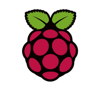
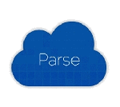

# Olentzero eta Maridomingi

_Laister_ 

## Tresnak

* **[Ahotts](http://sourceforge.net/projects/ahotts/)**: Euskarazko textu bati ahotsa ematen dion tresna.
* **[Raspberry PI](http://sourceforge.net/projects/ahotts/)**: Hardware murriztua duen koste baxu eta tamaina txikiko ordenagailua.
* **[Parse](https://parse.com/)**: Backend zerbitzuak eskaintzen dituen infraestruktura.

## Funtzionamendua

## Lizentzia
The MIT License (MIT)

Copyright &copy; 2015 Haritza Liburudenda